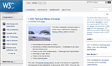

# Grid 과제

- 완성본 이미지


- 주어진 과제
    - 이미지는 “W3C 리뉴얼”이라는 캡션 위에 썸네일 이미지를 사용한다.
    (해당 이미지는 배경으로 지정하지 말고 `` 요소를 사용하여 콘텐츠 이미지로 배치)
    - grid를 활용하여 레이아웃을 구현한다.

-----
## HTML 코드 설명

```html
<section class="news-container">
    <h2 class="news">새소식</h2>
    
    <div class="more">
      <a href="/">
       더보기</a>
    </div>

    <div class="division-line"></div>

    <figure class="image-section">
      
      <figcaption class="image-caption">W3C 리뉴얼</figcaption>
    </figure>
    
    <div class="content-box">
      <h3 class="news-title">W3C 사이트가 리뉴얼 되었습니다.</h3>
      <p class="news-date">2022.07.18</p>
      <p class="news-content">디자인 및 다양한 ... </p>
    </div>
  </section>
```

### 구조

- 새소식 부분을 `news-container <section>`지정했습니다.
- 그 안에 `<h2>`, `more <div>`, `division-line <div>`, `image-section <figure>`, `content-box <div>` 를 가지고있습니다.
- `more <div>`는 더보기 앞의 이미지를 삽입하고 링크로 마크하였습니다.
- `division-line <div>`는 제목과 콘텐츠 사이의 구분선을 위해 만들었습니다.
- `image-section <figure>`은 이미지와 이미지 캡션을 묶기위해 사용했습니다.
- `content-box <div>`는 콘텐츠의 제목, 날짜, 내용을 묶어 두었습니다.

-----
## CSS 코드 설명

### 그리드 생성

```css
/* 새소식 컨테이너 */
.news-container {
  width: 380px;
  height: 200px;
  display: grid;
  grid-template-rows: auto;
  grid-template-columns: repeat(10, 1fr);
}
```
- 그리드는 가로와 세로 값을 넣고 그리드 칸은 `rows: auto`, `columns: repeat(10, 1fr)`을 지정했습니다.


- `grid-row`, `grid-column` 으로 위치를 지정하고 `margin`으로 배치했습니다.

-----
## 느낀 점

- 단순히 그리드를 만들어서 배치한다고만 생각했는데 어떤 식으로 나눌지 고민을 많이 해야하는 것을 알았습니다.
- 구현되는 것을 보며서 빠르게 이해될 것 같았는데 float이나 position보다 그리드가 오히려 더 어렵다고 느꼈습니다.
